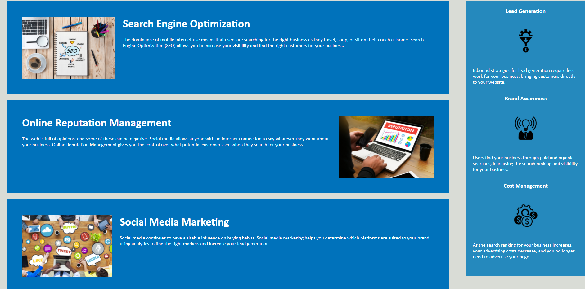

# Horiseon Code Refactor

## Link to the project
https://samz1n.github.io/Horiseon-Code-Refactor/

## Goals for this Project
* Revise the source code to include semantic HTML elements.
* Structure HTML elements in a logical way.
* Create alt attributes for all images.
* Align heading attributes in sequential order.
* Create a concise, descriptive title.

